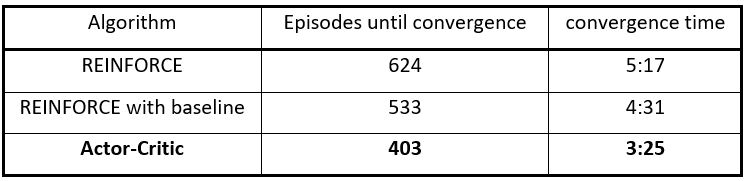
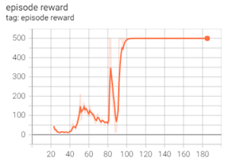
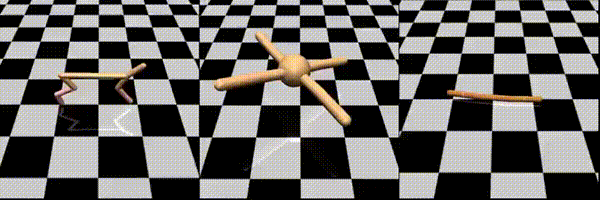

# Deep-Reinforcement-Learning

This repository contains the tasks created as part of the Deep Reinforcement Learning (DRL) course at the Ben-Gurion University of the Negev. 

**The field of deep reinforcement learning (DRL) is an area of deep learning that focuses on the development of tools that enable algorithms to self-learn in cases where the rules of the world are complex and full information is not available (e.g., autonomous driving).** This kind of ability is highly relevant to many fields: cybersecurity, medical data analysis, decision-making, etc. The course provided the **theoretical and practical knowledge** required to apply DRL techniques in their research.

---
## Assignments

  
  
   

[Assignment 1](Assignments/DRL_DQN_hw1.ipynb) – **From Q-learning to Deep Q-learning (DQN).** Experiment with OpenAI Gym, a testbed for Reinforcement Learning algorithms containing environments in different difficulty levels. the first part is an implementation of a tabular Q-learning model in a simple environment. The second part is on a larger scale environment and uses a NN function approximator of the Q-value, using the basic DQN algorithm. Finally, improvement to the DQN algorithm is implemented with one of the state-of-the-art algorithms from recent years. We implemented the Stochastic Prioritized Experience Replay improvement. This method aims to increase the effectiveness of using an experience buffer. Stochastic Prioritized Experience Replay replays the experiences which lead to larger TD error values with greater probability than experiences that lead to smaller TD error values.

[Assignment 2](Assignments/DRL_Ass2.ipynb) - **Policy Gradient Methods.** In this assignment, we optimize the policy of the agent directly with Policy Gradient methods. We first implement the basic REINFORCE algorithm (Monte-Carlo Policy Gradient) and then transform it into an Actor-Critic algorithm (Advantage Actor-Critic).

[Assignment 3 parts 1&2](Assignments/DRL_Ass3_keras_sec_1_sec_2.ipynb) [Assignment 3 parts 3](Assignments/DRL_Ass3_keras_sec_3.ipynb)- **Meta and Transfer Learning.** In this assignment, we design a reinforcement learning algorithm that leverages prior experience to figure out how to solve new tasks quickly. In recent literature, such methods are referred to as meta-reinforcement learning. Deep reinforcement learning algorithms usually require a large number of trials. Traditionally, learning a new task entails re-collecting a large dataset and training from scratch. Intuitively, knowledge gained in learning one task should help to learn new, related tasks more quickly. Humans and animals can learn new tasks in just a few trials. 

